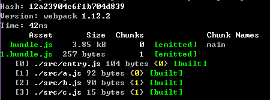

# 一些关于webpack用法的笔记

## 基本用法<https://github.com/petehunt/webpack-howto>
## 基本的配置文件

```javascript
module.exports = {
    entry: "./entry.js",
    output: {
        path: __dirname,
        filename: "bundle.js"
    },
    module: {
        loaders: [
            { test: /\.css$/, loader: "style!css" }
        ]
    }
};
```

## 1. "!"代表的意义
代表了加载器的流式调用,例如：

`{test : /\.css|less$/, loader : "!style!css!less"}`

就代表了先使用`less`加载器来解释`less`文件，然后使用`css`加载器来解析`less`解析后的文件，依次类推

>```javascript
require("!style!css!less!bootstrap/less/bootstrap.less");
// => the file "bootstrap.less" in the folder "less" in the "bootstrap"
//    module (that is installed from github to "node_modules") is
//    transformed by the "less-loader". The result is transformed by the
//    "css-loader" and then by the "style-loader".
//    If configuration has some transforms bound to the file, they will not be applied.
```

## 2. 请求参数
表示需要传入loader的参数(多半表示限制条件)，例如：

`{test : /\.png$/, loader : 'url-loader?mimetype=image/png'}`

## 3. 关于code-splitting
* 采用`require.ensure`方式划分文件块

>`require.ensure(dependencies, callback)`
>The require.ensure method ensures that every dependency in dependencies can be synchronously required when calling the callback. callback is called with the require function as parameter.
>`require.ensure` only loads the modules, it doesn’t evaluate them.

ensure 使得我们可在所有的dependencies项加载完毕后，再执行回调 。ensure仅仅是加载组件，并不会执行，若要执行，需要借助传进去的require参数。

本地三个模块a,b,c，各在模块中暴露一个全局变量
```javascript
var a = require("./a");
require.ensure(["./b"], function(require) {
    var c = require("./c");
});
```
编译之后发现：生成了两个块文件，ensure方式加载的文件模块被单独划分为一个块


打开chrome控制台,输入window.a,以及window.c会得到值,而window.b会显示undefine

* 采用CommonsChunkPlugin插件进行按需划分

## 4. Shim
如果某个需要全局依赖另一个模块，这时就需要将另一个模块挂载在全局

参考文档<https://github.com/webpack/docs/wiki/shimming-modules>
